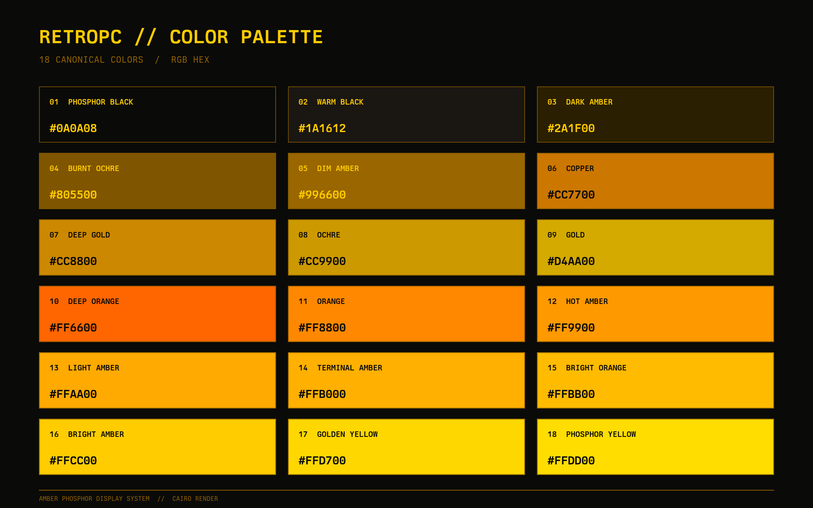

# Omarchy RetroPC Theme

This is the RetroPC Theme for [Omarchy.org](https://omarchy.org), providing a retro, cohesive and visually appealing configuration set for your Linux desktop environment.

<p align="center">
  
</p>

```
Remote terminals hum, a whisper in the wires,
Echoes of code beneath phosphor-lit spires.
Typing in shadows, the amber screen glows—
Revealing secrets only silence knows.
Old-school intrusion, soft light, sharp mind—where legends in dim rooms rewrote mankind.
```

## Installation

To install this theme, simply use the `omarchy-theme-install` command:

```bash
omarchy-theme-install https://github.com/rondilley/omarchy-retropc-theme
```

## Included Configurations

This theme includes configurations for:

- Omarchy 4 semantic palette (colors.toml)
- Omarchy 4 shell bar, menu, launcher, notifications, and lock screen (shell.*.toml)
- Alacritty (alacritty.toml)
- btop (btop.theme)
- Hyprland (hyprland.lua for Omarchy 4, legacy hyprland.conf/hyprlock.conf)
- Mako (mako.ini)
- Midnight Commander (mc.ini)
- Neovim (neovim.lua)
- Doom Emacs (retropc-theme.el)
- GTK 3 and GTK 4 (gtk-3.0/, gtk-4.0/, index.theme)
- GTK icon theme selection (icons.theme; Yaru-yellow-dark)
- Helix (helix.toml)
- Visual Studio Code (vscode-theme.json)
- Zed (zed.json)
- Waybar (waybar.css)
- Wofi (wofi.css)
- Walker (walker.css)
- SwayOSD (swayosd.css)
- Desktop backgrounds: amber tube, gold logo, and gold wordmark (backgrounds/)
- Font (fonts/Bm437_IBM_XGA-AI_12x23.otb)

## Omarchy 4 Support

`colors.toml` provides the semantic amber palette used to generate Omarchy 4
application themes. The `shell.*.toml` files carry the existing desktop surface
colors into the new shell while other sections use Omarchy's generated defaults.
The legacy application configurations and their custom font settings are retained.
Preview screenshots for the Omarchy 4 theme picker are not included.

Current Omarchy filters terminal configurations and Lua files from themes
installed through Git and regenerates them from the palette. This means the
bundled Alacritty/Ghostty font settings and custom Neovim configuration are not
automatically used through that installation route. Configure fonts separately
in your user terminal configuration if using it. Merely updating this repository
does not apply the theme or modify your active configuration.

The original Waybar, Walker, Mako, SwayOSD, and Hyprlock files remain available
for older installations. Omarchy 4 uses its shell in place of those components;
the shell overrides port appearance, not application-specific notification rules
or font configuration.

## Background Color Contract

Base surfaces are hard black `#000000` across the pack. The semantic
`background`, `dark_background`, and `darker_background` slots all use black,
so generated Omarchy application themes, Quickshell, and Hyprland share it with
handwritten terminal/editor/GTK themes. Inverse text using that base is black
as well; alpha values, handwritten amber ANSI colors, explicit raised surfaces,
selections, borders, and wallpaper pixels remain unchanged. Generated ANSI
color 0 and calculated mixed tints follow the new black base. Neovim's raised lualine surface stays
`#181813`, independent of the base.

After changing source, regenerate the palette chart and check all consumers:

```bash
python3 render-palette.py
python3 -B -m unittest discover -s tests
# Reapply without cycling the selected wallpaper:
OMARCHY_THEME_SKIP_BACKGROUND=1 omarchy theme set retropc
```

Reinstall the manual Doom, Zed, and Midnight Commander theme copies described
below. If Helix selects a manually installed `retropc` theme rather than
Omarchy's managed theme, refresh that copy as well. Already-open applications
may require their normal theme reload or a later restart. `theme.png` remains
a historical screenshot, not an automatically regenerated preview.

## Window Opacity (Omarchy 4)

`hyprland.lua` loads after Omarchy's default window rules. Application windows
are fully opaque when active, inactive, or fullscreen: the rule sets all three
opacity values to `1 override`, marks windows opaque, and ignores client alpha
with `force_rgbx`. Existing border colors are retained.

Quickshell's `org.quickshell` windows are excluded, and no layer rules or shell
alpha settings are changed. Quickshell bars, menus, popouts and lock surfaces
retain their existing transparency.

Use the reviewed user-owned theme directory/symlink route to retain this Lua
file. Omarchy filters Lua from Git-installed themes; that route does not apply
this custom window policy. Reapplying RetroPC and reloading Hyprland applies
it to existing windows without closing applications.

```bash
OMARCHY_THEME_SKIP_BACKGROUND=1 omarchy theme set retropc
hyprctl reload
hyprctl configerrors
```

## Gold Wallpapers

The two 4K gold wallpapers are by Erik Johansson, from
[Neon Glow](https://github.com/ejuro/omarchy-neon-glow-theme), under the
[MIT license](backgrounds/NEON-GLOW-LICENSE.txt). These images use Git LFS;
run `git lfs install` before cloning, or `git lfs pull` in an existing clone.

## Editor Themes

Omarchy automatically uses `helix.toml` and `vscode-theme.json` when applying
the theme. Restart VS Code after the first application so it can discover the
generated local extension.

Install the Doom Emacs theme and enable it in `~/.config/doom/config.el`:

```bash
mkdir -p ~/.config/doom/themes
cp retropc-theme.el ~/.config/doom/themes/
```

```emacs-lisp
(setq doom-theme 'retropc)
```

Zed is not currently synchronized by Omarchy. Install its theme manually:

```bash
mkdir -p ~/.config/zed/themes
cp zed.json ~/.config/zed/themes/retropc.json
```

Then select `RetroPC` in Zed's theme picker or set it in
`~/.config/zed/settings.json`:

```json
{
  "theme": {
    "mode": "dark",
    "dark": "RetroPC"
  }
}
```

## Midnight Commander

`mc.ini` follows the Zed theme's black panels, warm raised surfaces,
amber text, subtle brown selections, and orange errors. It covers file panels,
dialogs, menus, help, and the built-in editor, viewer, and diff viewer. Marked
files use brighter, bold amber so they remain distinct from the cursor row.
Editor syntax highlighting is controlled separately by MC's syntax files.

Requires a true-color terminal and an MC build with S-Lang true-color support
(MC 4.8.19+ and S-Lang 2.3.1+ on 64-bit systems). Run these commands from this
repository; no Omarchy hook is installed:

```bash
# Preview without installing the skin.
COLORTERM=truecolor mc --skin="$(pwd)/mc.ini"

# Install for your user.
mkdir -p ~/.local/share/mc/skins
cp mc.ini ~/.local/share/mc/skins/retropc.ini
mc --skin=retropc
```

Select `RetroPC — amber phosphor` in **Options → Appearance**, then use
**Options → Save setup** to keep it. Alternatively, with MC closed, set
`skin=retropc` in the existing `[Midnight-Commander]` section of
`~/.config/mc/ini`. If MC reports no true-color support, check `mc --version`,
ensure `COLORTERM` is `truecolor` or `24bit`, and use a terminal whose `TERM`
entry supports 256 colors (such as `xterm-256color`).

## Palette Reference



The chart contains the 18 canonical colors defined by the Alacritty and Neovim
configurations, including the hard-black base. Regenerate it with Cairo and Berkeley Mono:

```bash
python3 render-palette.py
```

## GTK Theme

Install and apply the GTK 3, GTK 4/libadwaita, and icon-theme integration:

```bash
./install-gtk.sh
```

The installer links this repository into `~/.local/share/themes/RetroPC`, adds
the GTK 4 user override needed by libadwaita applications such as Nautilus,
selects `Yaru-yellow-dark` icons, and installs `hooks/retropc-gtk` as an Omarchy
`theme-set` hook. The hook reapplies GTK when RetroPC is selected and removes
only its managed GTK 4 override when switching away. An existing user override
is backed up and restored automatically.

Restart open GTK applications after applying the theme.

## Recommended additions
Cool Retro Term
```bash
sudo pacman -S cool-retro-term
```
Retro Font
```bash
mkdir ~/.local/share/fonts/retro
cp fonts/Bm437_IBM_XGA-AI_12x23.otb ~/.local/share/fonts/retro
fc-cache
```

## Using Retro Fonts

**Don't forget to comment out the font definitions in ~/.config/alacritty.toml**

```
#[font]
#normal = { family = "CaskaydiaMono Nerd Font", style = "Regular" }
#bold = { family = "CaskaydiaMono Nerd Font", style = "Bold" }
#italic = { family = "CaskaydiaMono Nerd Font", style = "Italic" }
#size = 9
```

## Inspiration
[https://github.com/bjarneo/omarchy-ash-theme](https://github.com/bjarneo/omarchy-ash-theme)

## X.com
[Ron_Dilley](https://x.com/Ron_Dilley)
